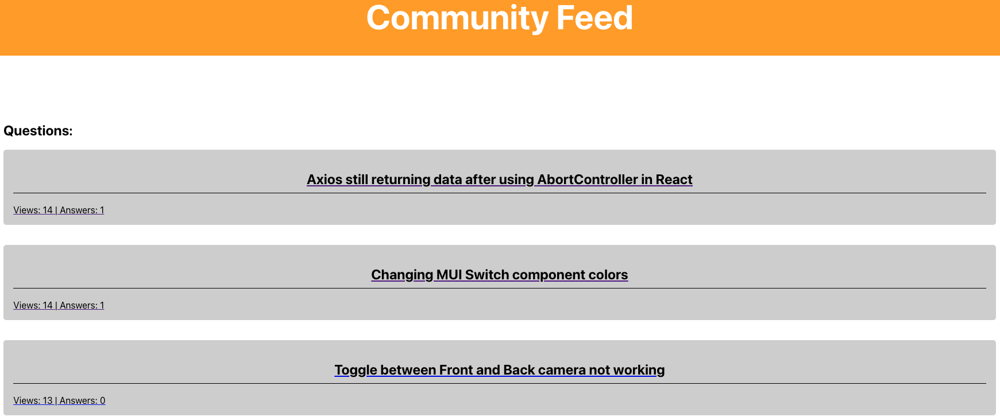

## Community Feed 



Next.js framework creates React apps without having to configure for compiling and building code or handle
features such as routing and data fetching. This project supports SSR and dynamic head tags for SEO purposes.

- In this project, the main focus is:
    1. Next.js
    2. Server Side Rendering (SSR)
    3. Search Engine Optimization (SEO) in React


```bash
npx create-next-app <project_name>
npm install react react-dom
npm install styled-components
```

### Main takeaways:

- With react-router package, we can add declarative routing to any React app.

- Using SSR can be helpful if you are building an app that need to render very quickly or you want certain info to be loaded before the web page is visible. 

- Next.js suports multiple data fetching:
    + dynamic data from the client
    + server side per request
    + static during build time

- For the app to be indexed by search engines, you need to set head tags for the crwalers to identify the content on the page.
    + This (Head tag) is something to do dynamically for each route
    + These head tags will now be used when running the app on server and client side, making it more suitable for being indexed by search engines.
