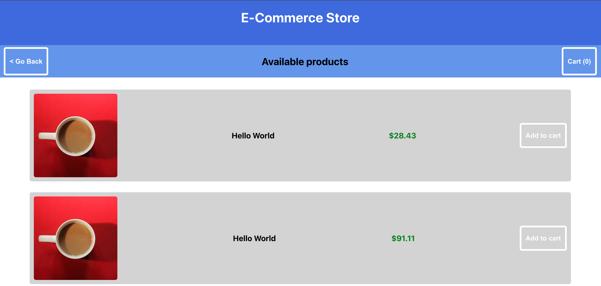

### React, Next.js, Apollo, GraphQL - E commerce

Next.js framework creates React apps without having to configure for compiling and building code or handle
features such as routing and data fetching.

This project supports SSR and dynamic head tags for SEO purposes.

