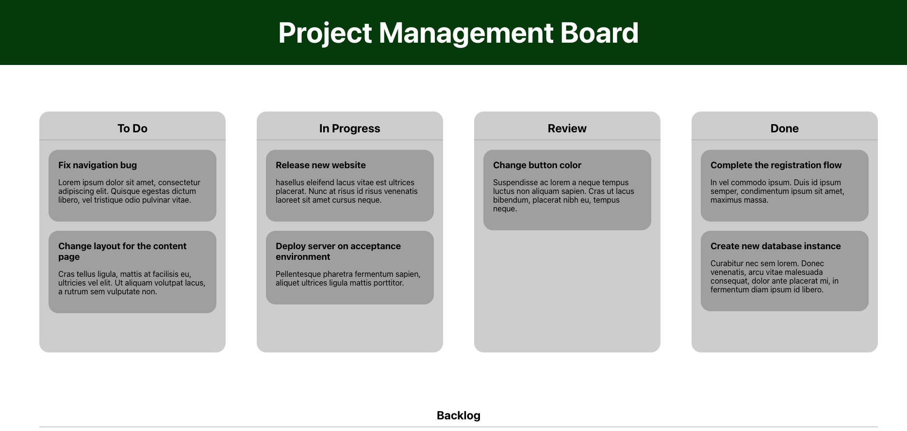

## Project management board



Creating a drag and drop project management board with React. The board will have columns for different stages of a project, and cards for individual tasks. The cards will be draggable and droppable between columns.

- In this project, the main focus is:
    1. Handling data flow
    2. Working with Hooks
    3. Using HTML5 web APIs for drag/drop functionality
    4. Styling React with styled-components


### Set up

- Same as before but with the addition of styled-components.

```bash
npm install styled-components
```


### Main takeaways:

- Hooks for data fetching that can be reused in other components.

- HTML5 drag and drop API.

- Hooks are a way to use React feature for creating local state or to wathc for updates in that state using life cycle.
    + They can also be used to reuse logic (react-router) for other components.

- Styled components allows us to write CSS inside JS and create components.
    + This allow more flexibility.

- The data flow is handled using local state and life cycles and determines which tasksare displayed in the different lanes.
