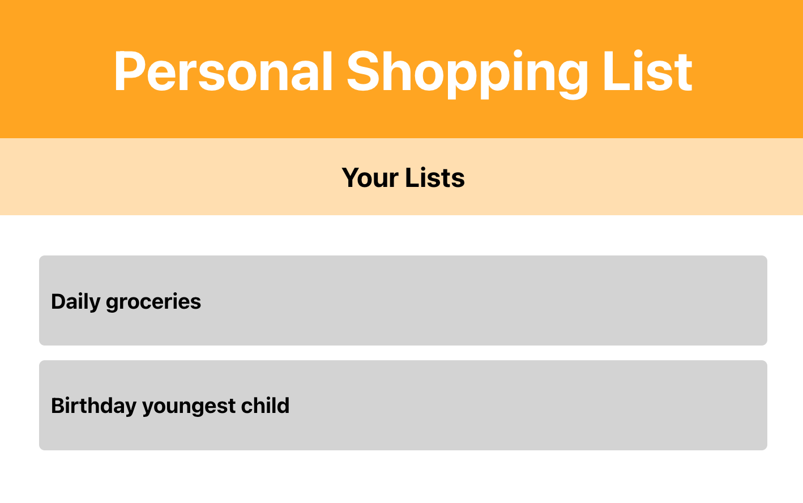

# Shopping List

This shopping list uses the Context API and Hooks to pass and retrieve data. Context is used to store data and Hooks are used to retrieve and mutate data. With the Context API, you can create more advanced scenarios for state management using the useReducer Hook. Context is also used to create a situation where all of the data is stored application-wide and can be accessed from any component by creating a shared Context. Finally, we've used React Suspense to apply code splitting to our bundle for improved performance.

- In this project, the main focus is:
    1. Context API for state management.
    2. Mutating Context with Hooks
    3. Code splitting with React Suspense

### Main takeaways:

- State management can be handled in React by creating an app state that is accessible from every component.

- useState and useEffect hooks can be good for local state management.

- Context API can be used for global state management.
    + React Component: Provider - initial value of context is placed
    + React Component: Consumer - any component within consumer can access the context value

- The most efficient way to get data conditionally from the Context is to use React Hooks to create a function that is added to the value of the Context.

- Mutating data on the Consumer :Life cycles can be added to components that are consuming context to invoke a function to do the data fetching inside our Context components.

- Mutating data on the Provider : The Flux pattern can be use to retrieve data and update it.
    - Pattern : dispatch action that would trigger the request to the server and based on the outcome, the reducer will mutate the data with this result.

- With more Provideers and Consumers, the messier things become. For this State management packages such as Redux tend to have and app state where all data fro the app is stored.

- To make the app more efficient, code splitting can be used to load only the necessary components when they are needed.
    + React feature called Suspense can be used for code splitting, which means you split compiled code into smaller chunks.
        - Suspense ltes components waint until the component is ready to be displayed
        -Suspense lazy method involves dynamic imports to load the components only when requested.