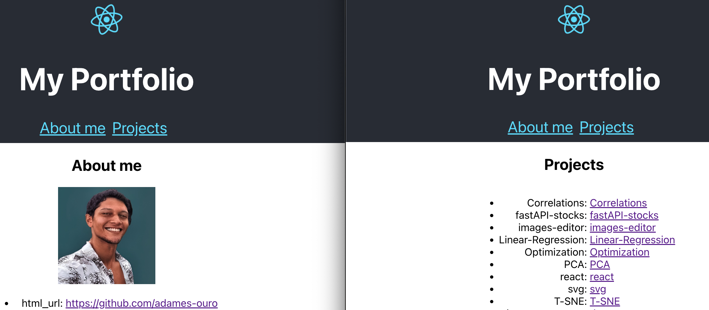

## Portfolio page



In this chapter, the Create React App is used to create a portfolio page. This template installs the necessary dependencies and sets up the project structure.

- In this project, the main focus is:
    1. Creating a new project with Create React App
    2. Building reusable React components
    3. Routing with react-router

### Setting up react project

- In the ublic folder there are files that are not included in the compile and build process

- index.js is the entry point fro create react app

- Any change in the code will be reflected in the browser


```bash
npx create-react-app <project-name>
npm install react-router-dom

```

### Main takeaways:

- Three types of components:
    1. Router components
    2. Route matching components
    3. Navigation components
