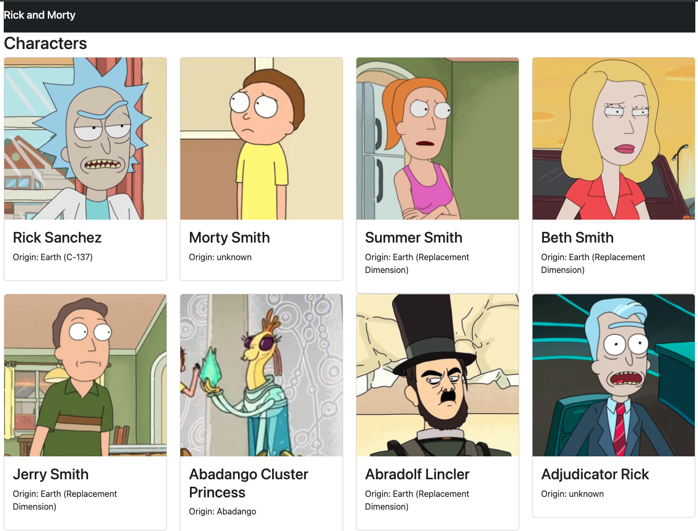

## Single web page



In this single page app based on Rick and Morty, the goal is to provide information about characters that we will fetch from an external source.

- In this project, the main focus is:
    1. Setting up react project
    2. Structure of project

### Setting up react project

- This single web app in react retrieves data from an API and runs in the browser with Webpack and Babel and styling with Bootstrap.

    + Webpack is a library that lets us create a bundle out of JavaScript/React code that can be used in a browser.

    + Running Webpack in production mode will minimize our code and decrease the size of the project bundle.

    + Babel lets us write JavaScript code using the latest version of the language and it will transpile it to a version that can be used in a browser.

    + EsLint is a library that helps us to keep our code clean and consistent. To configure ESLint, we need to create a file called .eslintrc in the project's root

```bash
npm init -y
npm install react react-dom
npm install --save-dev bootstrap
npm install --save-dev css-loader style-loader
npm install --save-dev webpack webpack-cli
npm install --save-dev html-webpack-plugin
npm install --save-dev webpack-dev-server
npm install --save-dev @babel/core @babel/preset-env @babel/preset-react babel-loader
npm install --save-dev eslint eslint-config-airbnb eslint-plugin-import eslint-plugin-jsx-a11y eslint-plugin-react
```

### Structure of project:

- The structure of the project is hybrid in a sense that we are using feature/pages and file type.


### Main takeaways:

- In react, anything stored in the state can be passed down to the low level components as props.

- A simple example of using state in React is by using useState Hook which can be used to store and update variables.

    + Every time the state is updated, the component will re-render.

- You can retrieve data by importing useState from React and adding this Hook to your component (fetch function ) .

    + The useEffect Hook is used to perform side effects in your component (fetching data).

- A promise is an undefined value that will be defined in the future. The promise can be resolved or rejected. Is similar to a placeholder for a value that will be available in the future.

    + The hook useEffect used to retrieve data using async/await
